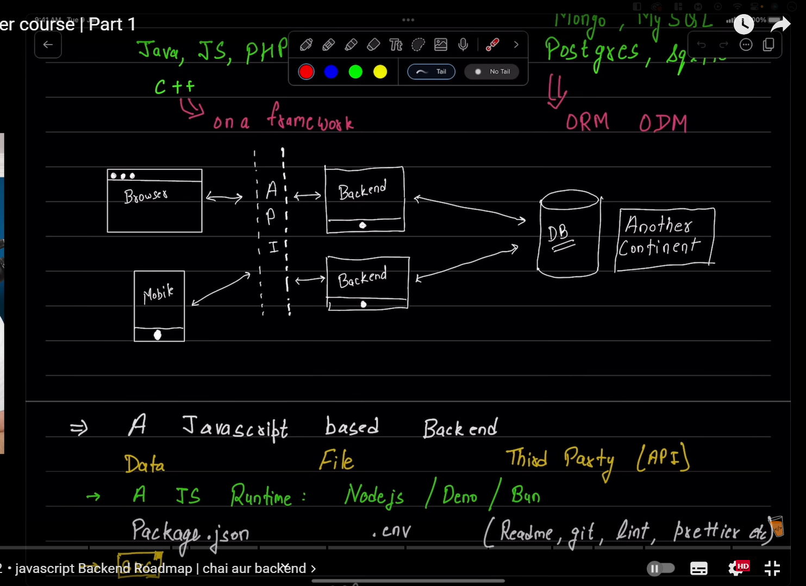
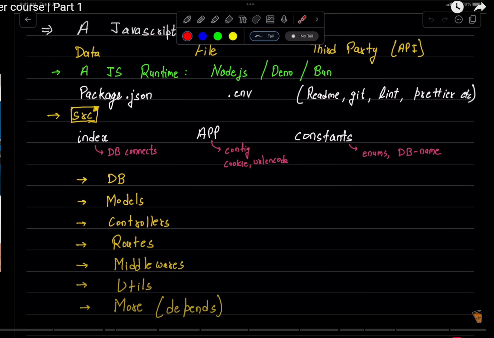
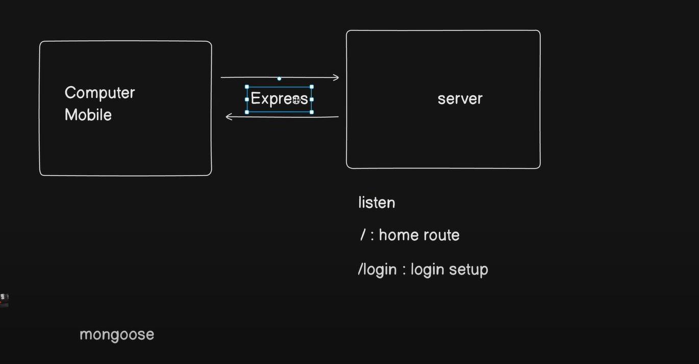
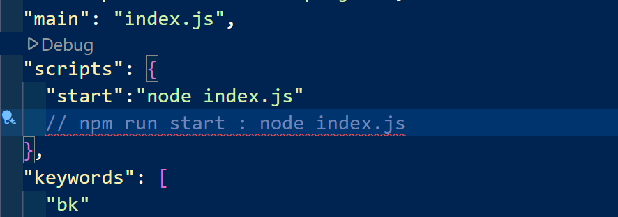
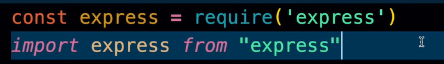
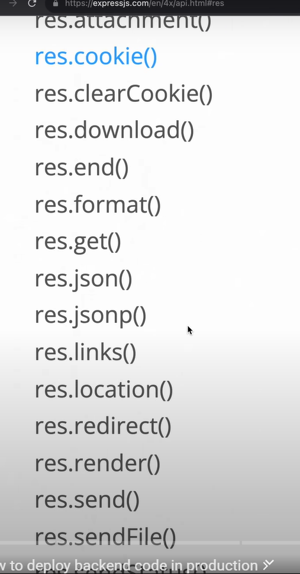
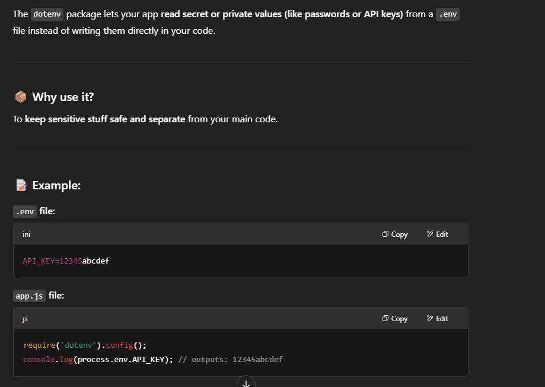

node, deno,bun ,v8 are runtimes of js

in backend koi bhi business logic programing lang se implmnt krnge on data stored in the db

backend me sirf 2 hi kam hota ha: data store krna and data retrieval

1 db and 1 PL ko master krna ha for backend

mongoose and express are frameworks of js that makes work esay in bakcend like react does in frontend

ORM and ODM -(Prisma , mongoose) are like framwork libraray of databases

code hum ek jagah likhte ha par unhe multiple machines par deploy kia ja skta ha for load balancing

DB humesha dusre continent me hota ha
Backend me bas alag alag fxns hi likhte ha aap..aur kuch nhi...wo fxns DB ke sath interact krte ha.....hum(server) jo response bhejte ha is called api
mostly apis are in json format, but can also be number values, true/false ,object, arrray etc

Js me 2 frameworks sikhne ha : 1. express(for routing) 2. mongoose for db

db fldr contains the actual code that connects the app with the db
mongoose, Prisma are libraries of db
models store the schema structure of data in the databases
mvc models/controllers store all the code of fxns/mthds used in the bakcend. they take in data and process them.
utiils are utilities that store the codes for repetititve work like uploading files / etc.
routes fldr handles page navigation

package.json file manages all the packages.

pura backend js ke rte like node.js par depend hota ha

# video 2

sunne wala kam sara express krta ha

when we write url in browsr, most of the times it is a get request.

in backend our aim is to make the server using exprss package
to make a node appln: write npm init -y

## there are 2 types of writing styles in js: common js and module

import wale ko ES6 kehte ha

there are numerous types of responses that we can send:

---

**Hot reloading** in React means:

> ✨ **When you save your code, the browser updates the page automatically without losing your app's current state (like form inputs or UI selections).**

---

### Example:

You change a button's color in your code and hit save → the page updates **instantly** , but:

- You **don’t lose your typing** in a form.
- You **stay on the same screen** .
- No, **React itself does not automatically restart or reload** your app when you save changes. That feature comes from the **development tools** around React — usually **Vite** , **Next.js** , **Create React App** , etc.

## use of dot env package:

.env file is written in CAPS;
deploy backend on aws,azure, digitalOcean, railway ,seeNode, render, cyclic.sh

those things that can be recreated like node modules are not pushed to github

---

**CI/CD** stands for **Continuous Integration** and **Continuous Deployment/Delivery** .

### In simple words:

👩‍💻 **CI (Continuous Integration)** :

Whenever a developer writes new code and saves (commits) it, the system **automatically checks** if it works properly (like running tests, checking for errors).

🚀 **CD (Continuous Delivery/Deployment)** :

Once the code passes all checks, it is **automatically sent** to the website/app without doing it manually.
